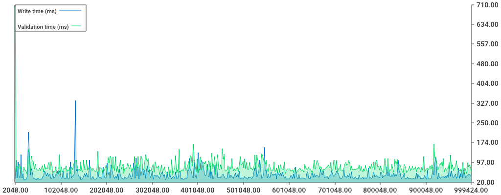
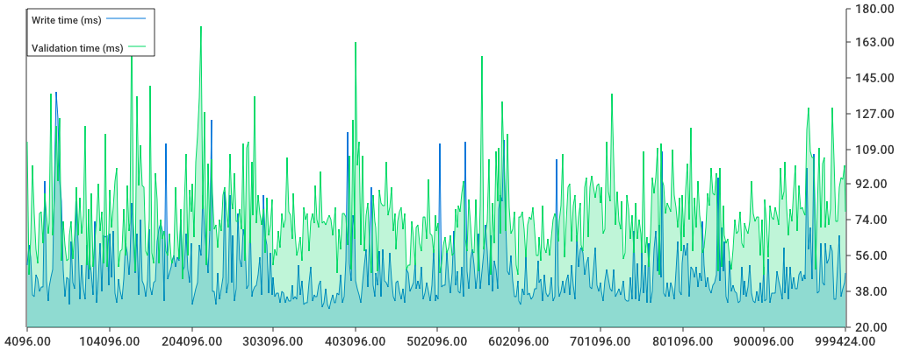
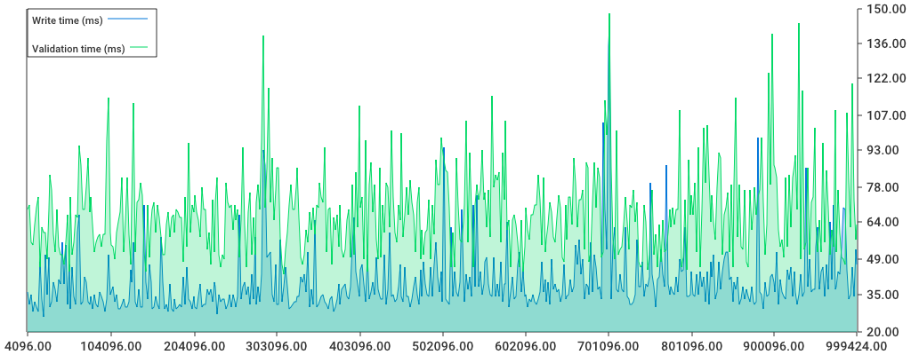

## Header Import

This repository is an attempt to benchmark header import in go-ethereum. Raw header import is typically performed during fast-sync or light-sync, 
where the headers are imported in batch, to be followed by the block data (transcations and receipts). 

This is a bit non-trivial to benchmark. While it's trivial to write a benchmark test, the tests are somewhat hard to translate to 'real world' numbers. 
- Tests cannot easily _both_ produce valid ethash PoW blocks, _and_ support arbitrary long chains (`b.N`). 
- There's an inherent linear factor in writes, since more blocks means more IO and more leveldb compactions. Thus, larger `b.N` values causes skewed results. 

The other way around, to do the testing in a 'production' setting, by simply syncing the chain and measuring the times is not perfect either: 
- It becomes dependent on network speeds, 
- And the quality of the peers at the time of the test, 
- And also, it becomes impacted by various other processes, 
  - such as the ongoing state-sync, 
  - and whether other peers are reqeuesting things from the node-under-tests

## Alternative

So this repository instead 

1. Opens an ancient folder (which contains valid headers) 
2. Instantiates a `HeaderChain`, without any networking or 'blockchainy' activity
3. Feeds the blocks into the `HeaderChain`, in chunks
4. Measures the `ValidationTime` and `WriteTime` separately, 
5. Produces a pretty chart. 

## Runs

## 1M blocks on `master`

Here is the first run, which is against go-ethereum `master` as of `15339cf1c9af2b1242c2574869fa7afca1096cdf` (with one tiny modification on top to expose the leveldb `FreezerTable`). 

The test imports `~1M` headers. 

Accumulated: 


Validation and write times are roughly on par, both rising  somewhat linearly. About `50s` is spent writing stuff to disk, and about `56s` is spent 
validating headers. During header import, the PoW validity is checked in roughly `1` header out of `100`.

Per-chunk:


It's a somewhat noisy graph, mainly the writes are causing the largest spikes. This is to be expected, since leveldb sometimes does compaction. What may be 
a bit surprising is that the validation graph also is pretty spiky. 


## 1M blocks on #21471

The [PR](https://github.com/ethereum/go-ethereum/pull/21471) for the second run changes how headers are handled during import, particularly during 
the `write` portion. Whereas `master` writes each header individually, the PR instead writes them in batches. This plays better with IO, and also has 
beneficial side-effects since less reads are required to validate the 'ancestorage' of a header (since all batches of headers are in contiguous chunks). 

(This run is made with the same tiny modification to expose `FreezerTable`.)

Accumulated:


This is a _substantial_ decrease in write-times, accumulating `24s` (previously `50s`). The validation times are untouched, at `56s`. 

Per-chunk:
:
```golang
	if chain.GetHeader(headers[index].Hash(), headers[index].Number.Uint64()) != nil {
		return nil // known block
	}
```
Which means, that if the header being imported is already present, it returns `nil`. This is an attempt to avoid processing already imported headers, 
and not have to do the expensive PoW verification when it's not needed. 

However, this also means that the N header-workers (`numcpu`) will do a heavy amount of leveldb reads. What's worse, in the 'normal' case, this check
will always fail, and since we don't have the header, it will not yield hits in the header-caches, but go all the way to leveldb (where it hopefully will 
only hit the leveldb bloom filters -- but still possibly cause disk lookups). 

Let's remove that check.

## 1M blocks without header-shortcut (`mod1`)

Accumulated:


The `writes` are un-affacted, as expected, but now we've gone down from `56s` to `45s`. 

Per-chunk:


The spikes are still there, but now less pronounced. 

There are a couple more optimizations we can do, primarily regarding hashing. A `types.Header` does not cache the hash after doing a `Hash()` operation, 
as opposed to a `types.Block`. Therefore, we should be careful about not needlessly hashing it. 

Doing a `Hash()` is somewhat cpu-intensive, and it is also somewhat memory intense. A lot of allocations causes overhead; both for the 
actual allocation itself, and secondly for the golang garbage collector. In practice, if we can reduce the alloc-work for e.g. header import, 
it can improve things on a system-level, i.e for other processes running simultaneously. 

The hashing is performed in two places. Within [ethash](https://github.com/ethereum/go-ethereum/blob/master/consensus/ethash/consensus.go#L177) itself: 

```golang

func (ethash *Ethash) verifyHeaderWorker(chain consensus.ChainHeaderReader, headers []*types.Header, seals []bool, index int) error {
	var parent *types.Header
	if index == 0 {
		parent = chain.GetHeader(headers[0].ParentHash, headers[0].Number.Uint64()-1)
	} else if headers[index-1].Hash() == headers[index].ParentHash {
		parent = headers[index-1]
	}
```
Here we check if the `ParentHash` matches the hash of the previous header, performed in the parallel verification..
And also in [ValidateHeaderChain](https://github.com/ethereum/go-ethereum/blob/b643b9ca9423647aabd886d813cec7ef55be7947/core/headerchain.go#L302), where it is not parallelized. 

```
func (hc *HeaderChain) ValidateHeaderChain(chain []*types.Header, checkFreq int) (int, error) {
	// Do a sanity check that the provided chain is actually ordered and linked
	for i := 1; i < len(chain); i++ {
		parentHash := chain[i-1].Hash()
		if chain[i].Number.Uint64() != chain[i-1].Number.Uint64()+1 || chain[i].ParentHash != parentHash {
			// Chain broke ancestry, log a message (programming error) and skip insertion
			log.Error("Non contiguous header insert", "number", chain[i].Number, "hash", chain[i].Hash(),
				"parent", chain[i].ParentHash, "prevnumber", chain[i-1].Number, "prevhash", parentHash)

			return 0, fmt.Errorf("non contiguous insert: item %d is #%d [%x…], item %d is #%d [%x…] (parent [%x…])", i-1, chain[i-1].Number,
				parentHash.Bytes()[:4], i, chain[i].Number, chain[i].Hash().Bytes()[:4], chain[i].ParentHash[:4])
		}
```

Both of them are doing the same check. Interestingly, the same check is also done in the `downloader`, before it delivers the headers to the upper layers. 
For now, let's cancel the non-parallel check. 

## 1M blocks with less hashing (`mod2`)

Accumulated:


The `validation` dropped another second, from `45` to `44`. 
Per-chunk:


Let's try to make it even faster. 

## 1M blocks with less syncronization (`mod3`)

There's a check, after each header validated, whether the chain is exiting. This is performed via an `atomic` check. Atomics are useful, but 
they're not a lot faster than `sync.Mutex`, so they do carry an overhead. Now, when the chain is exiting, it doesn't quite matter if we stall 
for a few hundred milliseconds, as long as we're lot stalling for tens of seconds. So we can move that check to instead be performed
_after_ the parallel verifier completes. 

Accumulated:


The `validation` dropped from `44` to `40`!
 
Per-chunk:


## 1M blocks without `Now`

When running a profiler, I saw that a lot of time was spent on `time.Now()`. Apparently the `time.Now` is a non-trivial operations, which returns a 
struct representing the time in nanoseconds, in both wall-clock format and monotonic clock format. 
This call was being made for every header, to check if it was too far off in the future ( go-ethereum allows a drift of up to, but not exceeding `15s`). 

Since all the verifications are done within one second, we can instead take the time once, for each chunk, and pass it to the parallel verifiers. 

Accumulated:


Validation is now at `38s`, and writes at `~24s`.
I made one change to the charts, so it skips plotting out the very first point, to make the chart display nicer:

Per-chunk:



### Summary

With these changes, we got down to a `62s` for `1M` headers, from `106s` on `master`, and `80s` on [PR 21471](https://github.com/ethereum/go-ethereum/pull/21471/files).

## 1M blocks with faster difficulty calculator (`mod5`)

The final one, I hardly believe myself. But let's see some benchmarks first: 
```
BenchmarkDifficultyCalculator/big-6             	 2638527	       383 ns/op	      80 B/op	       7 allocs/op
BenchmarkDifficultyCalculator/big-frontier-6         	 1767679	      1065 ns/op	     280 B/op	      12 allocs/op
```

Apparently the difficulty calculators are not very optimized; both slow and heavy on allocs.

If we re-write the difficulty calculators to be based on `uint256`:

```
BenchmarkDifficultyCalculator/u256-6   		     	 8936229	       135 ns/op	      64 B/op	       2 allocs/op
BenchmarkDifficultyCalculator/u256-frontier-6        	10010191	       163 ns/op	      64 B/op	       2 allocs/op
```

So apparently, the we can cut the average time by a third, and for the segment (0-1M blocks) we're experimenting with, we can take it down almost by an order
of magnitude, from `1ms` to `0.16ms`. Which also relieves some GC-pressure. Let's try it: 

Accumulated:


Per-chunk:



With the last changeset, the total `validation` time goes down to `34s`, and write-time to `20s`. Which brings the total down from 

1. On master, `106s`,
2. On [PR 21471](https://github.com/ethereum/go-ethereum/pull/21471/files) `80s`
3. And finally, `54s`!

Tantalizingly close to an even doubling in speed!


